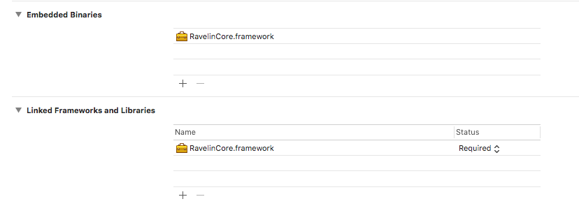

## Contents

* [Installation](#installing-the-ravelin-mobile-sdk-via-cocoapods)
* [Usage](#usage)
* [Examples](#end-to-end-example)
* [Class Reference](#ravelin-class-reference)
* [License](#license)

## Building the SDK from source

If you wish to build the framework from source, the source code repository uses Git LFS (large file storage) to store some files. Please install Git-LFS before cloning locally. Follow the instructions on the [Git LFS website](https://git-lfs.github.com/) to set LFS up.

## Installing the Ravelin Mobile SDK via Cocoapods

Add `pod 'RavelinCore'` to your PodFile then from the command line `pod install`

## Installing the Ravelin Mobile SDK via Carthage

Add the following line to your Cartfile

`github "unravelin/ravelin-ios" == 0.3.0`

Then from the command line 

`carthage update`

## Installing the Ravelin Mobile SDK (manually)

The Ravelin Mobile SDK is provided as a precompiled Cocoa Touch framework.

To manually install:

1. Open your project or xcworkspace

2. Select the Product target or the xcodeproj and goto the “General” tab

3. Find or search for “Embedded Binaries” and drag and drop the RavelinCore.framework file to it. At the prompt, select “copy items if needed”


4. The framework should now be shown in Embedded Binaries and Linked Frameworks and Libraries. If you do not see it in Linked Frameworks and Libraries, repeat step 3 for this section also.


Note: You can use RavelinCore and RavelinEncrypt independently, or you can use both together. RavelinCore provides fingerprinting and session tracking functionality, while RavelinEncrypt provides encryption only.

## Preparing for the App Store

- Ravelin’s encryption algorithm qualifies for exemption provided under category 5 part 2  - Information Security ECN 5X (5A002.a.a.1) of the BIS Export Administration Regulation as the primary function is “information security” and therefore no export compliance documentation is required in App Store Connect.

- The framework is a "fat binary" and contains an `x86_64` build for the Xcode simulator along with device builds. At the time of writing, if you have manually installed the framework and are using Xcode to send your app to the App Store, you will need to add the script below in build phases to 'thin out' the binary to remove the simulator architectures.  This is achieved by selecting your project and going to Build Phases and using + to add a new "Run Script Phase".
 


```swift

# This script loops through the frameworks embedded in the application and
# removes unused architectures.
# See https://stackoverflow.com/questions/46404236/failed-to-verify-bitcode-while-exporting-archive-for-ad-hoc-distribution-tried

APP_PATH="${TARGET_BUILD_DIR}/${WRAPPER_NAME}"

find "$APP_PATH" -name '*.framework' -type d | while read -r FRAMEWORK
do
FRAMEWORK_EXECUTABLE_NAME=$(defaults read "$FRAMEWORK/Info.plist" CFBundleExecutable)
FRAMEWORK_EXECUTABLE_PATH="$FRAMEWORK/$FRAMEWORK_EXECUTABLE_NAME"
echo "Executable is $FRAMEWORK_EXECUTABLE_PATH"

EXTRACTED_ARCHS=()

for ARCH in $ARCHS
do
echo "Extracting $ARCH from $FRAMEWORK_EXECUTABLE_NAME"
lipo -extract "$ARCH" "$FRAMEWORK_EXECUTABLE_PATH" -o "$FRAMEWORK_EXECUTABLE_PATH-$ARCH"
EXTRACTED_ARCHS+=("$FRAMEWORK_EXECUTABLE_PATH-$ARCH")
done

echo "Merging extracted architectures: ${ARCHS}"
lipo -o "$FRAMEWORK_EXECUTABLE_PATH-merged" -create "${EXTRACTED_ARCHS[@]}"
rm "${EXTRACTED_ARCHS[@]}"

echo "Replacing original executable with thinned version"
rm "$FRAMEWORK_EXECUTABLE_PATH"
mv "$FRAMEWORK_EXECUTABLE_PATH-merged" "$FRAMEWORK_EXECUTABLE_PATH"

done
```

## Usage

To use the framework within your project, import RavelinCore where required:

#### Objective-C
```objc
#import <RavelinCore/Ravelin.h>
```

#### Swift
```swift
import RavelinCore
```

The singleton Ravelin class should be accessed via the sharedInstance method. You will first need to initialise the SDK with the `createInstance` method call with your Ravelin public API key.

#### Objective-C
```objc

// Instantiation for tracking
self.ravelin = [Ravelin createInstance:@"publishable_key_live_----"];
```

#### Swift
```swift

// Instantiation for tracking
let ravelin = Ravelin.createInstance("publishable_key_live_----")
```

Once initialised, you can use the sharedInstance directly to access methods and properties

#### Objective-C
```objc

// Directly
[[Ravelin sharedInstance] methodName];

// Variable
Ravelin *ravelin = [Ravelin sharedInstance];

```

#### Swift
```swift

// Directly
Ravelin.sharedInstance().methodName()

// Variable
let ravelin = Ravelin.sharedInstance()
```

## Tracking Activity

Using the Ravelin Mobile SDK, you can capture various built in events along with your own custom ones that can later be viewed in the Ravelin Dashboard. This can be very useful for analysts to gain additional context during an investigation. For example, if you can see that a user is going through unexpected parts of your customer journey at a set speed on a new device that could indicate suspicious activity. 

> `Ravelin.trackPage:(NSString *)pageTitle` - to indicate when the user hits a new page. 

> `Ravelin.trackLogin:(NSString *)pageTitle eventProperties:(NSDictionary *)eventProperties` - to indicate that the user has just authenticated themselves. Use eventProperties to add additional key/pair information to the payload

> `Ravelin.trackLogout:(NSString *)pageTitle eventProperties:(NSDictionary *)eventProperties` - to indicate when the user has signed out of their session.

> `Ravelin.trackFingerprint:(NSDictionary *)eventProperties` – To be used at checkout to profile the users device.

## Custom Events and Metadata

The track method can be used to log notable client-side events:

#### Objective-C
```objc
NSString *pagetitle = @"products";
NSString *eventName = @"PRODUCT_SEARCH";
NSDictionary *meta = @{@"productId" : @"213", @"sizeId" : @"M"};
[[Ravelin sharedInstance]track:pageTitle eventName:eventName eventProperties:meta];
```

#### Swift
```swift
let pageTitle = "products"
let eventName = "PRODUCT_SEARCH"
let meta = ["productId" : "213", "SIZE" : "M"]
Ravelin.sharedInstance().track(pageTitle, eventName: eventName, eventProperties: meta)
```

## Detecting paste events

We can detect paste events using the UITextFieldDelegate method `shouldChangeCharactersInRange` in conjunction with the Ravelin `track` method to send a custom event.

#### Objective-C
```objc
- (BOOL)textField:(UITextField *)iTextField shouldChangeCharactersInRange:(NSRange)range replacementString:(NSString *)string
{
    // Only detect specific textfields in our app
    if(iTextField.tag == 1002 || iTextField.tag == 1003) { return NO; }
    
    // Check if the textfield contains pasted text
    if([string containsString:[UIPasteboard generalPasteboard].string]) {
    
        // Send paste event to Ravelin
        NSString *pageTitle = @"home";
        NSString *pasteLength = [NSString stringWithFormat:@"%ld", (long)[UIPasteboard generalPasteboard].string.length];
        NSDictionary *meta = @{@"pasteLength": pasteLength};
        [self.ravelin track:pageTitle eventName:@"paste" eventProperties:meta];
    }
    
    return YES;
}
```

#### Swift

```swift
func textField(_ textField: UITextField, shouldChangeCharactersIn range: NSRange, replacementString string: String) -> Bool {
    
    if(string.contains(UIPasteboard.general.string ?? "")){
        let pageTitle = "home"
        let eventName = "paste"
        let pasteLength : String = "\(UIPasteboard.general.string?.count ?? 0)"
        let meta = ["pasteLength" : pasteLength]
        self.ravelin.track(pageTitle, eventName: eventName, eventProperties: meta)
    }
    return true
}
```

> __NOTE:__ Track events have overload methods with completion handlers and will accept nil values for `eventProperties`

## Fingerprint location tracking

> For location tracking to be successful from within the Ravelin Mobile SDK, your application should ask for user permissions for location sharing. Please refer to the Apple documentation [here](https://developer.apple.com/documentation/corelocation) for more information on the subject.


## End to end example

What follows is a simple end-to-end example of using the Ravelin Framework within a View.

> __NOTE:__ All Ravelin network methods are asynchronous. Completion blocks are provided so you can handle each request accordingly. The example code will not necessarily call each method sequentially and is for demonstration purposes only.


#### Objective-C
```objc
#import "ViewController.h"
#import <UIKit/UIKit.h>
#import <RavelinCore/Ravelin.h>
@interface ViewController ()
@property (strong, nonatomic) Ravelin *ravelin;
@end

@implementation ViewController


- (void)viewDidLoad {
    [super viewDidLoad];

    // Make Ravelin instance with api keys
    self.ravelin = [Ravelin createInstance:@"publishable_key_live_----"];
    
    // Setup customer info and track their login
    self.ravelin.customerId = @"customer1234";
    self.ravelin.orderId = @"web-001";
    [self.ravelin trackLogin:@"loginPage"];
    
    // Track customer moving to a new page
    [self.ravelin trackPage:@"checkout"];
    
    // Send a device fingerprint
    [self.ravelin trackFingerprint];
    
    // Send a device fingerprint with a completion block (if required)
    [self.ravelin trackFingerprint:^(NSData *data, NSURLResponse *response, NSError *error) {
        if(!error) {
            NSDictionary *responseData;
            NSHTTPURLResponse *httpResponse = (NSHTTPURLResponse *)response;
            if (httpResponse.statusCode == 200) {
                responseData = [NSJSONSerialization JSONObjectWithData:data options:NSJSONReadingMutableContainers|NSJSONReadingAllowFragments error:nil];
                // Do something with responseData
                
            } else {
                // Status was not 200. Handle failure
            }
        } else {
            NSLog(@"%@",error.localizedDescription);
        }
    }];
    
    // Track a customer logout
    [self.ravelin trackLogout:@"logoutPage"];
}
@end
```

#### Swift

```swift
import UIKit
import RavelinCore

class ViewController: UIViewController {

    // Declare Ravelin Shared Instance with API keys
    private var ravelin : Ravelin = Ravelin.createInstance("publishable_key_live_----")
     
    
    override func viewDidLoad() {
        super.viewDidLoad()
        
        // Setup customer info and track their login
        ravelin.customerId = "customer1234"
        ravelin.orderId = "web-001"
        ravelin.trackLogin("loginPage")
        
        // Track customer moving to a new page
        ravelin.trackPage("checkout")
        
        // Send a device fingerprint
        ravelin.trackFingerprint()
        
        // Send a device fingerprint with a completion block (if required)
        ravelin.trackFingerprint { (data, response, error) -> Void in
            if let error = error {
                // Handle error
                print("Ravelin error \(error.localizedDescription)")
            } else if let httpResponse = response as? HTTPURLResponse {
                if httpResponse.statusCode == 200 {
                    // Handle success
                }
            }
        }
        
        // Track a customer logout
        ravelin.trackLogout("logoutPage")

    }
}
```

# Ravelin Class Reference

## Ravelin Class Methods

---
## createInstance (apiKey)

Create a singleton instance of the Ravelin SDK with your public API key (use this method to create an SDK instance for tracking purposes only)

### Parameters

| Parameter     | Type               | Description  |
| ------------- |---------------------|-------|
| apiKey     | String     | The public api key from your Ravelin dashboard |

### Return value

> The singleton instance of the class

---

## sharedInstance

Get the instantiated Ravelin singleton


### Return value

> The singleton instance of the class

---

## trackFingerprint

Fingerprints the device and sends results to Ravelin

---

## trackFingerprint (completionHandler)

Fingerprints the device and sends results to Ravelin

### Parameters

| Parameter     | Type               | Description  |
| ------------- |---------------------|-------|
| completionHandler     | Object     | Completion block to handle response |

---

## trackFingerprint(customerId, completionHandler)

Sets a customerId if one has not already been set and sends a fingerprint to Ravelin

### Parameters

| Parameter     | Type               | Description  |
| ------------- |---------------------|-------|
| customerId     | String     | The customerId to set for this device fingerprint. |
| completionHandler     | Object     | Completion block to handle response |

---

### Return value

> Dictionary containing the complete payload to send

---

## track (pageTitle, eventName, eventProperties)

Sends a track event to Ravelin. Use this method to send custom events and data to analyse in your dashboard.

### Parameters

| Parameter           | Type            | Description  |
| --------------------|-----------------|----------------------------|
| pageTitle           | String          | The title of the current page |
| eventName           | String          | The name of the event |
| eventProperties     | Dictionary      | A dictionary of meta data to send with the event |

> Also available with a completion handler: track (pageTitle, eventName, eventProperties, completionHandler)

---

## trackPage (pageTitle, eventProperties)

Sends a track page event to Ravelin.

### Parameters

| Parameter           | Type            | Description  |
| --------------------|-----------------|----------------------------|
| pageTitle           | String          | The title of the current page |
| eventProperties     | Dictionary      | A dictionary of meta data to send with the event |

> Also available with a completion handler: trackPage (pageTitle, eventProperties, completionHandler)


---


## trackLogin (pageTitle, eventProperties)

Sends a track login event to Ravelin

### Parameters

| Parameter           | Type            | Description  |
| --------------------|-----------------|----------------------------|
| pageTitle           | String          | The title of the current page |
| eventProperties     | Dictionary      | A dictionary of meta data to send with the event |

> Also available with a completion handler: trackLogin (pageTitle, eventProperties, completionHandler)


---

## trackLogout (pageTitle, eventProperties)

Ends current Ravelin session and sends logout event to Ravelin

### Parameters

| Parameter           | Type            | Description  |
| --------------------|-----------------|----------------------------|
| pageTitle           | String          | The title of the current page |
| eventProperties     | Dictionary      | A dictionary of meta data to send with the event |

> Also available with a completion handler: trackLogout (pageTitle, eventProperties, completionHandler)

---

## Ravelin Class Properties

---

## apiKey

> The public api key from your dashboard 


## customerId

> Your chosen customer id 


## tempCustomerId

> Temp customer id  


## sessionId (read only)

> The Ravelin generated sessionId


## deviceId (read only)

> The Ravelin generated device id 


## orderId

> Your chosen order id

--- 

# License

License information can be found [here](https://github.com/unravelin/ravelin-ios/blob/0.3.0-docs/LICENSE)
