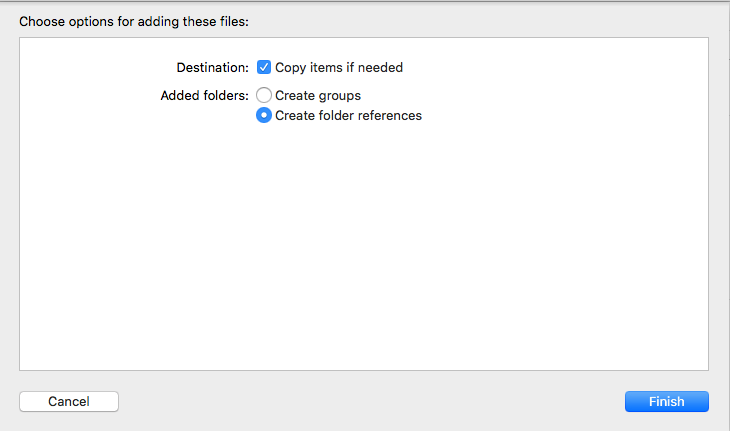
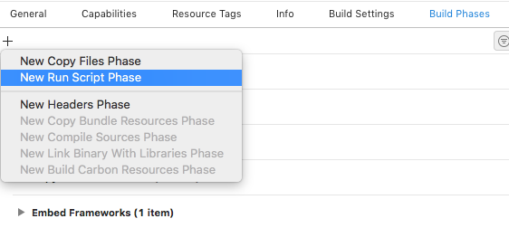

# How to use RavelinEncrypt

## Contents

* [Building And Installation](#building-and-installation)
* [Usage](#usage)
* [Examples](#end-to-end-example)
* [Class Reference](#rvnencryption-class-reference)
* [License](#license)

## Building and Installation
### Building the SDK from source

If you wish to build the framework from source, the source code repository uses Git LFS (large file storage) to store some files. Please install Git-LFS before cloning locally. Follow the instructions on the [Git LFS website](https://git-lfs.github.com/) to set LFS up.

### Installing the Ravelin Encryption SDK via Cocoapods

Add `pod 'RavelinEncrypt'` to your PodFile then from the command line `pod install`

### Installing the Ravelin Encryption SDK via Carthage

Add the following line to your Cartfile

`github "unravelin/ravelin-ios" == 0.3.0`

Then from the command line 

`carthage update`

### Installing the Ravelin Encryption SDK (manually)

The Ravelin Encryption SDK is provided as a precompiled Cocoa Touch framework.

To manually install:

1. Open your project or xcworkspace

2. Select the Product target or the xcodeproj and goto the “General” tab

3. Find or search for “Embedded Binaries” and drag and drop the RavelinEncrypt.framework file to it. At the prompt, select “copy items if needed”


4. The framework should now be shown in Embedded Binaries and Linked Frameworks and Libraries. If you do not see it in Linked Frameworks and Libraries, repeat step 3 for this section also.

Note: You can use RavelinCore and RavelinEncrypt independently, or you can use both together. RavelinCore provides fingerprinting and session tracking functionality, while RavelinEncrypt provides encryption only.

### Preparing for the App Store

- Ravelin’s encryption algorithm qualifies for exemption provided under category 5 part 2  - Information Security ECN 5X (5A002.a.a.1) of the BIS Export Administration Regulation as the primary function is “information security” and therefore no export compliance documentation is required in App Store Connect.

- The framework is a "fat binary" and contains an `x86_64` build for the Xcode simulator along with device builds. At the time of writing, if you have manually installed the framework and are using Xcode to send your app to the App Store, you will need to add the script below in build phases to 'thin out' the binary to remove the simulator architectures.  This is achieved by selecting your project and going to Build Phases and using + to add a new "Run Script Phase".
 


```swift

# This script loops through the frameworks embedded in the application and
# removes unused architectures.
# See https://stackoverflow.com/questions/46404236/failed-to-verify-bitcode-while-exporting-archive-for-ad-hoc-distribution-tried

APP_PATH="${TARGET_BUILD_DIR}/${WRAPPER_NAME}"

find "$APP_PATH" -name '*.framework' -type d | while read -r FRAMEWORK
do
FRAMEWORK_EXECUTABLE_NAME=$(defaults read "$FRAMEWORK/Info.plist" CFBundleExecutable)
FRAMEWORK_EXECUTABLE_PATH="$FRAMEWORK/$FRAMEWORK_EXECUTABLE_NAME"
echo "Executable is $FRAMEWORK_EXECUTABLE_PATH"

EXTRACTED_ARCHS=()

for ARCH in $ARCHS
do
echo "Extracting $ARCH from $FRAMEWORK_EXECUTABLE_NAME"
lipo -extract "$ARCH" "$FRAMEWORK_EXECUTABLE_PATH" -o "$FRAMEWORK_EXECUTABLE_PATH-$ARCH"
EXTRACTED_ARCHS+=("$FRAMEWORK_EXECUTABLE_PATH-$ARCH")
done

echo "Merging extracted architectures: ${ARCHS}"
lipo -o "$FRAMEWORK_EXECUTABLE_PATH-merged" -create "${EXTRACTED_ARCHS[@]}"
rm "${EXTRACTED_ARCHS[@]}"

echo "Replacing original executable with thinned version"
rm "$FRAMEWORK_EXECUTABLE_PATH"
mv "$FRAMEWORK_EXECUTABLE_PATH-merged" "$FRAMEWORK_EXECUTABLE_PATH"

done
```

## Usage

To use the framework within your project, import RavelinEncrypt where required:

#### Objective-C
```objc
#import <RavelinEncrypt/RavelinEncrypt.h>
```

#### Swift
```swift
import RavelinEncrypt
```

The singleton RVNEncryption class should be access via the sharedInstance method. You must then provide your RSA key for card encryption.

#### Objective-C
```objc
// Instantiation for encryption
self.ravelinEncrypt = [RVNEncryption sharedInstance];
self.ravelinEncrypt.rsaKey = @"----|----";
```

#### Swift
```swift

// Instantiation for encryption
let ravelinEncrypt = RVNEncryption.sharedInstance()
ravelinEncrypt.rsaKey = "----|----"
```

Once initialised, you can use the sharedInstance directly to access methods and properties

#### Objective-C
```objc

// Directly
[[RVNEncryption sharedInstance]] methodName];

// Variable
RVNEncryption *ravelinEncrypt = [RVNEncryption sharedInstance];

```

#### Swift
```swift

// Directly
RVNEncryption.sharedInstance().methodName()

// Variable
let ravelinEncrypt = RVNEncryption.sharedInstance()
```

### Encrypting Cards

The SDK can be used to allow the secure sharing of card information with Ravelin whilst removing the need to handle PCI-compliant data.

When collecting the card details, we encrypt the values to send using the code method below. Validation is performed, confirming that expiry dates are valid and that the PAN is at least 13 characters. Should any validation checks fail, `nil` is returned from the method. Pass an error by ref to determine the cause of failure if any occurs.

#### Objective-C
```objc
// Card details
NSString *pan = @"41111111111111";
NSString *month = @"10";
NSString *year = @"2022";
NSString *cardHolder = @"Mr John Doe";

// Error handling
NSError *error;

// Encrypt
NSDictionary *encryptionPayload = [[RVNEncryption sharedInstance] encrypt:pan month:month year:year nameOnCard:cardHolder error:&error];

if(!error) {
    NSLog(@"Ravelin encryption payload: %@",encryptionPayload);
    // Send to your servers

} else {
    NSLog(@"Ravelin encryption error %@", error.localizedDescription);
}
```

#### Swift
```swift
var error:NSError? = nil

let encryptionPayload = RVNEncryption.sharedInstance().encrypt("41111111111111", month: "10", year: "10", nameOnCard: "Mr John Doe", error: &error)

if let error = error {
    print("Ravelin encryption error \(error.localizedDescription)")
} else {
    print("Ravelin Encryption payload: \(encryptionPayload as AnyObject)")
    // Send to your servers
}
```

## End to end example

What follows is a simple end-to-end example of using the Ravelin Framework within a View.

#### Objective-C
```objc
#import "ViewController.h"
#import <UIKit/UIKit.h>
#import <RavelinEncrypt/RavelinEncrypt.h>
@interface ViewController ()
@property (strong, nonatomic) RVNEncryption *ravelinEncrypt;
@end

@implementation ViewController

- (void)viewDidLoad {
    [super viewDidLoad];

    // Make RavelinEncrypt instance with rsa key
    self.ravelinEncrypt = [RVNEncryption sharedInstance];
    self.ravelinEncrypt.rsaKey = @"----|----";

    // Encrypt customer card details, ready for sending for payment
    NSError *error;
    NSDictionary *encryptionPayload = [self.ravelinEncrypt encrypt:@"41111111111111" month:@"10" year:@"20" nameOnCard:@"Mr John Doe" error:&error];
    if(!error) {
        NSLog(@"Ravelin Encryption payload: %@", encryptionPayload);
    } else {
        NSLog(@"Ravelin encryption error %@", error.localizedDescription);
    }
}
@end
```

#### Swift

```swift
import UIKit
import RavelinEncrypt

class ViewController: UIViewController {

    private var ravelinEncrypt = RVNEncryption.sharedInstance()
    
    
    override func viewDidLoad() {
        super.viewDidLoad()
        
        // set up ravelin encryption RSA key
        
        ravelinEncrypt.rsaKey = "----|----"
        
        // Encrypt customer card details, ready for sending for payment
        var error:NSError? = nil
        let encryptionPayload = ravelinEncrypt.encrypt("41111111111111", month: "10", year: "20", nameOnCard: "Mr John Doe", error: &error)
        if let error = error {
            print("Ravelin encryption error \(error.localizedDescription)")
        } else {
            print("Ravelin Encryption payload: \(encryptionPayload as AnyObject)")
            // Send to server
        }
    }
}
```

## RVNEncryption Class Reference

### RVNEncryption Class Methods

---

### sharedInstance

Get the instantiated RVNEncryption singleton


**Return value**

The singleton instance of the class

---

### encrypt (pan, month, year, nameOnCard, &error)

Generates encryption payload ready for sending to Ravelin

**Parameters**

| Parameter     | Type               | Description  |
| ------------- |---------------------|-------|
| pan     | String     | A string representation of the long card number |
| month     | String     | Expiry month of card (1-12) |
| year     | String     | Expiry year (2 or 4 digit) |
| nameOnCard     | String     | The customer name on the card |
| error     | Object     | Passed as reference |

**Return value**

Dictionary containing methodType, aesKeyCiphertext, cardCiphertext, algorithm, keyIndex and ravelinSDKVersion

--- 

### RVNEncryption Class Properties

---

#### rsaKey

The public RSA key from your dashboard


# License

License information can be found [here](https://github.com/unravelin/ravelin-ios/blob/0.3.0-docs/LICENSE)
